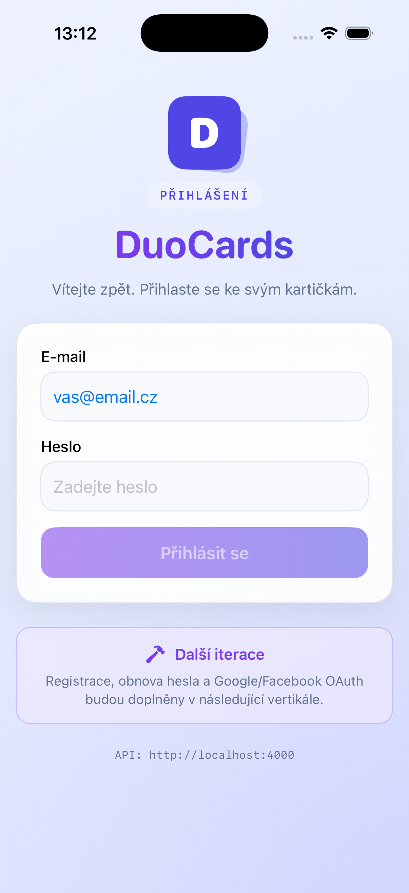
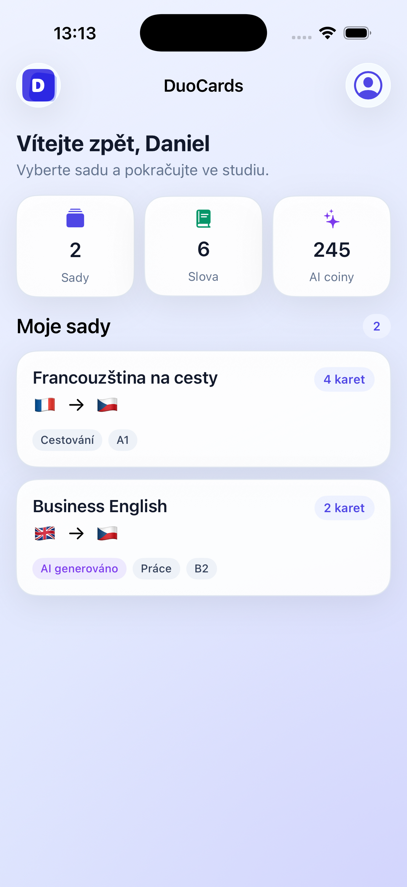
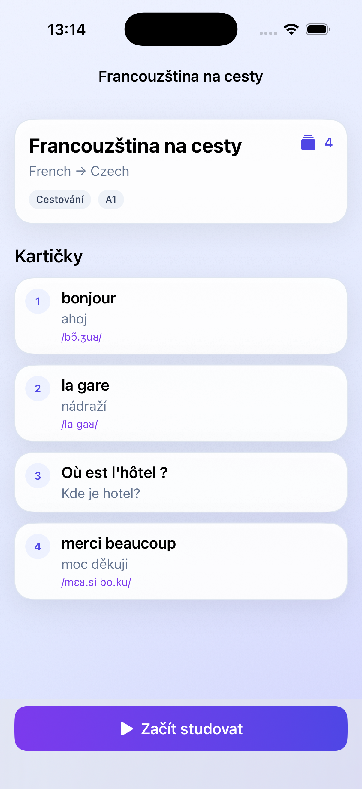
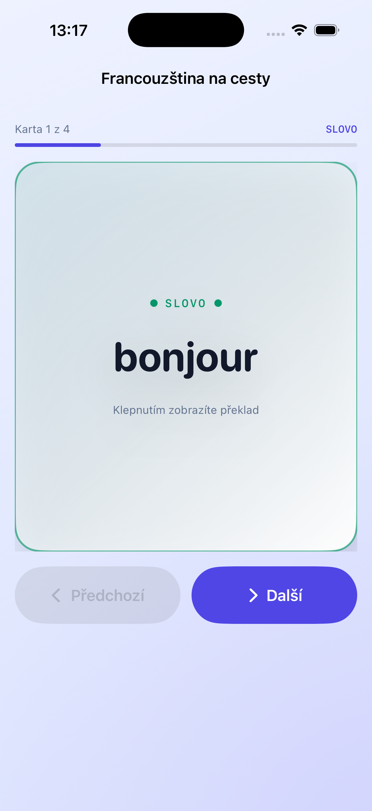

# DuoCards pro iOS

První nativní vertikála DuoCards je SwiftUI aplikace pro iOS 17 a novější. Nevyužívá externí balíčky a komunikuje se samostatným [DuoCards backendem](https://github.com/danicek555/duocards-backend) přes `/api/v1` s cookie session.

## Spuštění

1. Ujisti se, že produkční DuoCards backend odpovídá na
   `https://duocards-backend-731652720086.europe-west1.run.app/health`.
2. Otevři `DuoCards.xcodeproj` v Xcode.
3. Vyber scheme **DuoCards**, iOS Simulator a spusť aplikaci.

Konfigurace **Debug** i **Release** ve výchozím stavu používají produkční
Cloud Run backend. Adresu lze pro lokální vývoj změnit bez zásahu do kódu:

- v Xcode scheme přidej launch argument `-duocardsAPIBaseURL https://example.com`, nebo
- nastav environment proměnnou `DUOCARDS_API_BASE_URL`.

Volitelnou záložní adresu nastav přes `DUOCARDS_API_FALLBACK_URL` nebo launch
argument `-duocardsAPIFallbackURL`. Klient ji zkusí po síťové chybě nebo po
odpovědi 502/503/504 z Cloud Run.

Zadává se pouze origin backendu, tedy bez koncového `/api/v1`; klient si
verzovanou cestu přidá sám.

## Cloud Run vs. vlastní (lokální) server

Při startu aplikace proběhne health-check nastaveného backendu. Pokud Cloud Run
odpovídá, aplikace pokračuje normálně. Pokud je Cloud Run vypnutý a backend
neodpovídá, zobrazí se banner „Backend (Cloud Run) je nedostupný“ s možností
*Zkusit znovu* a *Nastavit server*.

V *Nastavení serveru* (ikona ozubeného kola na úvodní obrazovce) lze zadat
adresu **vlastního (lokálního) backendu**, například `http://192.168.1.20:4000`.
Uložená adresa se persistuje v `UserDefaults` a přepíše výchozí Cloud Run origin
(nepřebije ale launch argument/environment proměnnou pro vývoj). Volbou *Použít
výchozí Cloud Run* se aplikace vrátí zpět. Podrobný popis modelu je v
[backend dokumentaci](https://github.com/danicek555/duocards-backend/blob/main/docs/CLOUD_RUN_AND_LOCAL_BACKEND.md).

Poznámka: `localhost` v iOS Simulatoru odkazuje na Mac, ale na fyzickém iPhonu
na samotný telefon. Pro backend spuštěný na Macu proto jako fallback použij
jeho LAN adresu, například `http://192.168.1.20:4000`, a měj obě zařízení na
stejné Wi-Fi. Pro produkci použij HTTPS adresu.

Produkční API origin je
`https://duocards-backend-731652720086.europe-west1.run.app`. Klient si cestu
`/api/v1` přidá sám.

Reset hesla umí vložit samotný 43znakový base64url token, legacy 64znakový
hex token nebo celý HTTPS odkaz `/reset-password#token=...`; po dobu přechodu
umí načíst i starý query tvar `?token=...`. App-level
`onOpenURL` je připravený jen pro stejný HTTPS tvar; záměrně není registrované
nevlastněné custom URL scheme. Automatické otevření odkazu z e-mailu v aplikaci
je release gate: produkční doména musí publikovat správné AASA a target musí mít
omezený Associated Domains entitlement. Do té doby uživatel vloží celý odkaz.

## Spuštění na fyzickém iPhonu

1. Zpřístupni backend na HTTPS adrese dosažitelné z iPhonu. Nejjednodušší
   bude později Cloud Run; `localhost` na telefonu odkazuje na samotný iPhone.
2. Připoj iPhone k Macu, potvrď důvěru a na telefonu zapni
   **Nastavení → Soukromí a zabezpečení → Režim pro vývojáře**.
3. V Xcode otevři target **DuoCards → Signing & Capabilities**, nech zapnuté
   **Automatically manage signing** a vyber svůj Apple Developer Team. Pokud je
   `xyz.duocards.ios` obsazené pro jiný tým, nastav vlastní unikátní Bundle ID.
4. V **Product → Scheme → Edit Scheme → Run → Arguments** můžeš přidat
   `DUOCARDS_API_FALLBACK_URL=http://IP-MACU:4000`, bez `/api/v1`.
5. V horní liště Xcode vyber připojený iPhone a stiskni **Run**. První signed
   instalace je zároveň poslední kontrola provisioningu; unsigned terminálový build
   ji nedokáže nahradit.

Pro lokální backend na Macu použij raději dočasnou HTTPS adresu/tunel. Prosté
`http://IP-MACU:4000` není součástí Release konfigurace.

## Screenshoty aktuálního buildu

| Přihlášení | Dashboard | Detail sady | Studium |
| --- | --- | --- | --- |
|  |  |  |  |

Síťově nezávislý screenshot režim je dostupný pouze v Debug buildu přes
launch environment proměnnou `DUOCARDS_DEMO_SCREEN` s hodnotou `login`,
`dashboard`, `detail` nebo `study`. Release vždy používá skutečný API klient.

## Aktuální rozsah

- e-mailová registrace s 29 podporovanými locale, kontrolou síly hesla, šestimístným ověřovacím kódem a resend cooldownem;
- žádost o obnovu hesla s jednotnou veřejnou odpovědí, vložení reset
  odkazu/tokenu, stejná strong-password validace a bezpečné vyčištění tokenu i
  hesel;
- obnovení cookie session, přihlášení a odhlášení;
- dashboard se sadami, součtem slov a mincemi;
- detail sady včetně seznamu slov;
- vytvoření, úprava a smazání vlastní sady přes `/api/v1/flashcard-sets`;
- nativní editor 1–100 karet s volitelnými jazyky, výslovností, obtížností a nejvýše 5 tagy;
- nativní studijní obrazovka s otočením karty, navigací zpět/další a načtením obrázku i výslovnosti z oddělených media endpointů;
- dekódování obrázků uložených jako data URL;
- SwiftUI previews s lokálními ukázkovými daty;
- unit testy pro data URL, tolerantní dekódování API modelů, registrační a
  password-reset state flow a validaci editoru včetně mutation DTO.

Nativní OAuth zůstává další identity vertikálou.

## Ověření z terminálu

```sh
xcodebuild \
  -project DuoCards.xcodeproj \
  -scheme DuoCards \
  -destination 'generic/platform=iOS Simulator' \
  -derivedDataPath /tmp/DuoCardsDerivedData \
  CODE_SIGNING_ALLOWED=NO \
  build-for-testing
```

Testy lze následně spustit na konkrétním dostupném simulátoru přes akci `test` v Xcode nebo `xcodebuild`.

## Struktura

- `DuoCards/App` – vstup aplikace, session a přepínání přihlášeného stavu;
- `DuoCards/Core` – konfigurace, networking, design tokeny a utility;
- `DuoCards/Domain` – API modely;
- `DuoCards/Features` – přihlášení, dashboard, editor/detail sady a studium;
- `DuoCards/Support` – mock API a data pro previews.

Další fáze jsou rozepsané v `IMPLEMENTATION_PLAN.md`.
